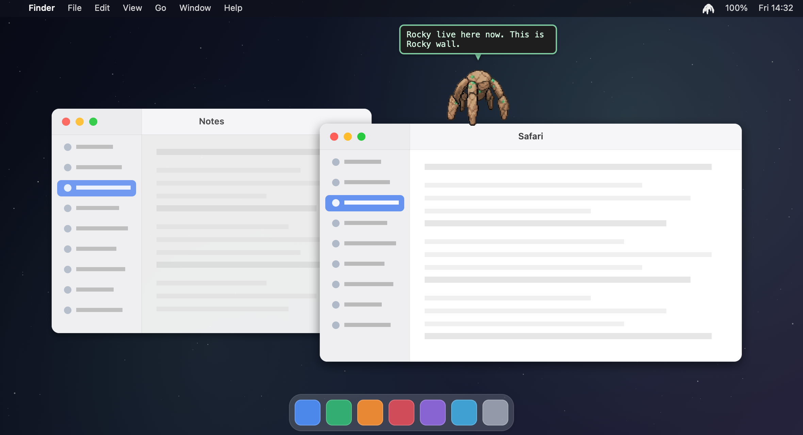
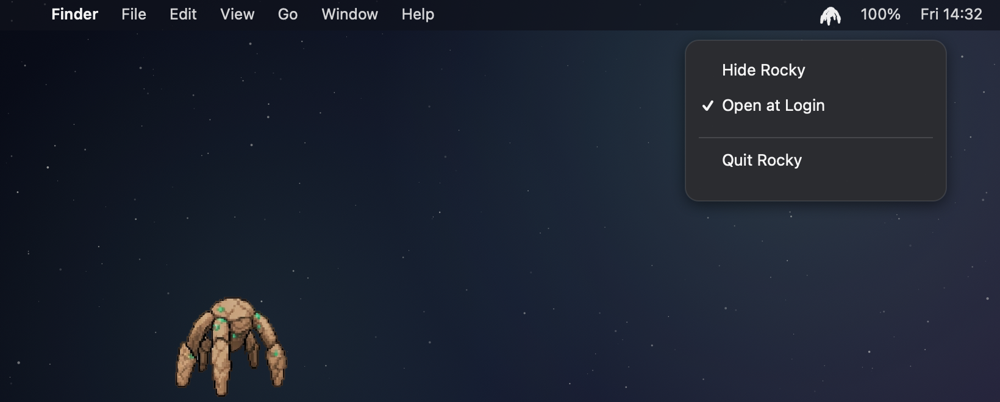
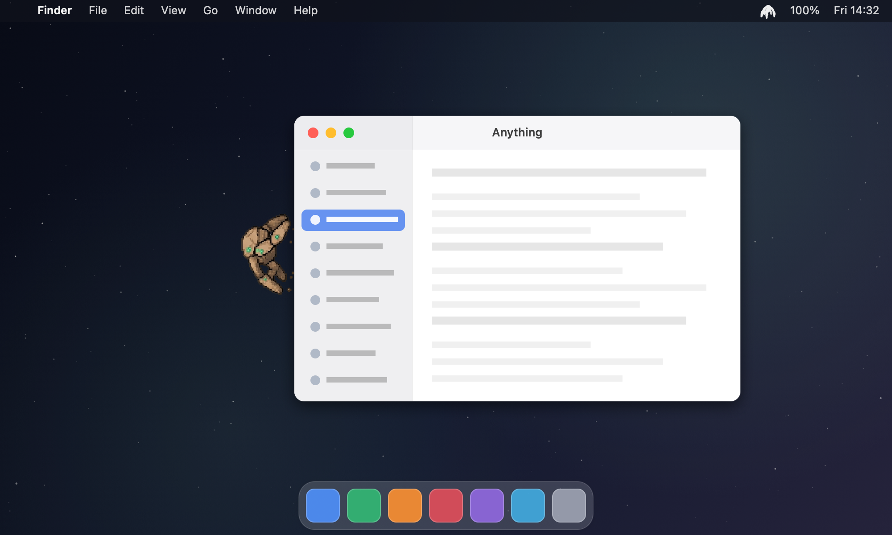

<div align="center">



# Rocky

**Rocky from *Project Hail Mary*, living on your desktop.**

He walks the edges of your screen, climbs all over your windows, watches your
pointer, naps when you leave, and shouts Rocky-isms. Clicks pass straight
through him — except when you click *him*.

[](LICENSE)
[](#install)
[](#install)
[](#what-he-notices)

</div>

---

## Install

```sh
git clone https://github.com/chiradeep-varma/rocky-mac-pet.git
cd rocky-mac-pet
./build.sh
cp -R build/Rocky.app /Applications/
open /Applications/Rocky.app
```

That's the whole thing. No Xcode project, no package manager, no dependencies —
just the Swift toolchain (`xcode-select --install`) and macOS 14 or later.

> Copy it to `/Applications` **before** enabling *Open at Login*: macOS registers
> login items by path, so moving the app afterwards breaks the entry. Toggle it
> off and on again if you do.

---

## The menu bar

<div align="center">

</div>

No Dock icon and no window in the app switcher — he lives entirely in the menu
bar (`LSUIElement`).

| Item | What it does |
|---|---|
| **Hide / Show Rocky** | Hiding invalidates the display link, so he costs literally nothing |
| **Open at Login** | The checkmark reflects the real system state, via `SMAppService` |
| **Quit Rocky** | Goodbye, friend |

---

## He climbs everything

<div align="center">

</div>

Every window is a surface. He walks along the top, clings to either side, and
hangs upside down underneath — then hops to the next one. He only uses edges you
can actually see: a window buried behind another one is not something he'll cling
to, because clinging to an invisible border looks like clinging to nothing. Raise
another window over the one he's on and he scrambles off it.

---

## What he notices

Strictly what macOS hands over **without a permission prompt**. No Accessibility,
no Screen Recording, no Input Monitoring — nothing to approve, nothing to revoke.
He reads window *geometry* and owner names; window titles and keystrokes require
permissions he deliberately never asks for, and are never read.

| He notices | And does |
|---|---|
| Your open windows | Crawls right around them, hops between them |
| The app you switch to | *Sometimes* wanders over. Mostly he carries on, like a cat |
| An app launching | More likely to go look, but still not every time |
| Your pointer | Wanders over to watch it; turns to face it when idle |
| You going quiet | Naps after five minutes, and is pleased when you're back |
| The screen sleeping | Stops the render loop entirely |
| Battery under 20% | Worries at you once, until you plug in |
| The clock | Different lines late at night and first thing in the morning |
| Clicks on him | Pets, sparkles, reacts — drag him and he scrambles to the nearest surface |

**115 lines of dialogue**, every one tagged with the cue that earns it, so he only
says the thing when the thing is true: *"Many many windows"* needs seven of them
open, *"Sun gone. You still here. Why, question?"* needs it to actually be night.
Every real Rocky line from the book is in there.

---

## Credits

Rocky is a character from **Andy Weir's *Project Hail Mary***. This is an
unofficial fan project, not affiliated with or endorsed by the author or
publisher. Started life as a [VS Code extension](https://github.com/chiradeep-varma/rocky-pet)
before escaping the editor.

Released under the [MIT License](LICENSE).

<div align="center">
<br>
<i>"Fist my bump."</i>
</div>
